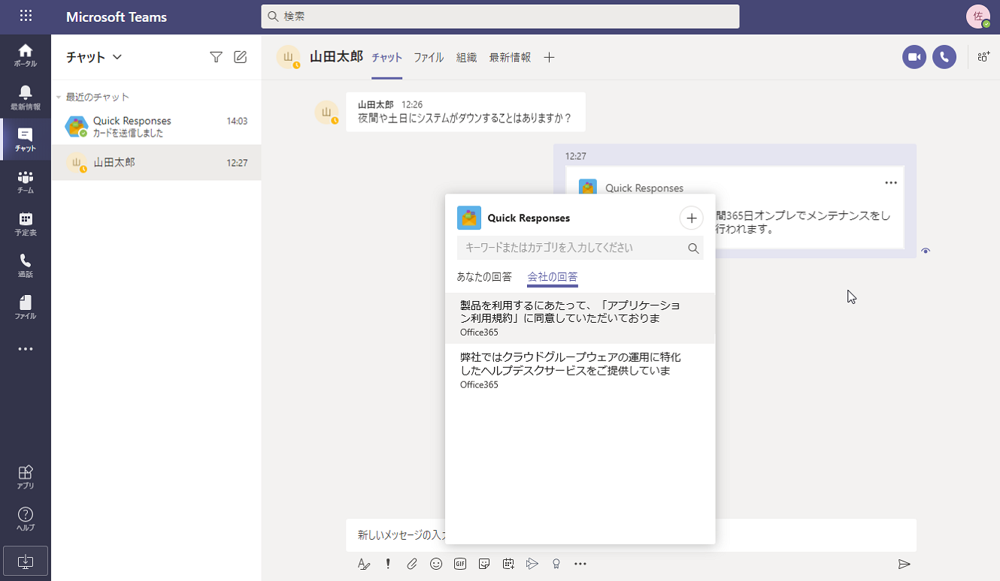
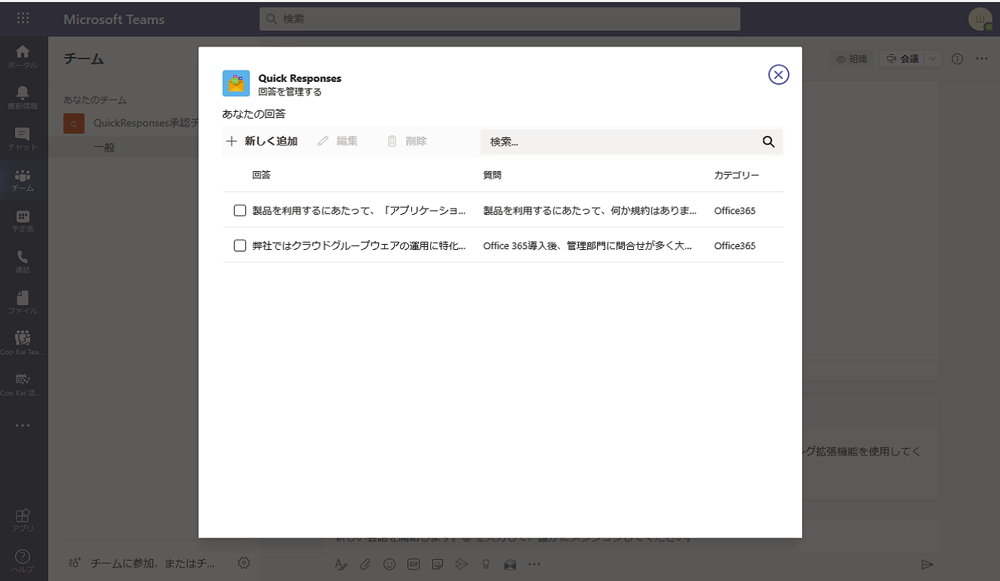

# Quick Responsesアプリテンプレート

## はじめに

**
アプリケーション概要

テクニカルサポートなどの分野では、よくある質問への迅速な回答は、人間の介入をほとんど必要とせずに一般的な質問への回答を提供するため、顧客と技術専門家の両方にとって効果的なソリューションです。
さらに、営業担当者または技術サポート担当者は、顧客やユーザーからの質問に対して同じまたは同様の回答を送信します。ただし、これらの草案を作成するのに費やした時間は、彼らの時間を最大限に活用したものではありません。Microsoft TeamsのQuick Responsesアプリを使用することで、生産性を向上させ、これらの回答の作成と照合に費やす時間を削減します。
ユーザーは、Microsoft TeamsのQuick Responsesを使用して、回答のライブラリを構築し、メッセージング拡張機能を使用して、回答を検索して挿入し、作成する時間と労力を節約できます。さらに、メッセージアクションを介して既存のチャットからアプリを呼び出し、既存のリストに回答を追加できます。ユーザーは公開された回答のライブラリを利用して、最新かつ正確な状態を維持することができます。

## 構成内容
本テンプレートは次の要素で構成されています
 1. Quick Responsesソリューション
 2. 管理者向け展開ガイド
 3. エンドユーザー向け利用者ガイド

## 展開・利用に必要な条件
本テンプレートを展開・利用するには以下が必要となります。詳しくは日本マイクロソフト担当者までお問い合わせください。
 - 次の種類のリソースを作成できるAzureサブスクリプションと管理者アカウント
 - App service
 - App service プラン
 - Azure ストレージアカウント
 - Webアプリボット
 - Application Insights
 - Azure search service

## 準備されている言語
本テンプレートは日本語で準備されており、追加で以下の言語に対応します

 - 日本語 (Japanese)
 - 英語 (English)

## 主な機能
Quick Responsesアプリは、ユーザーからよく寄せられる質問に対して効率的に回答するための機能を有しています。

 - よく寄せられる質問の回答をユーザーごとに登録して管理
 - 組織全体での回答の共有
 - 登録された回答を素早く検索して提供

## ダウンロード
以下のリンクより最新版バージョンをダウンロードいただけます。  
    [最新のリリースページへ移動]<<Gitが決まってから更新>>

## 展開方法
管理者向け展開ガイドを参照してください

**免責事項**

本テンプレートおよび関連サービスは、各企業のニーズを全て含めるように設計されたものではなく、そのような用途で使用されるものではありません。実際の利用や必要な追加のカスタマイズは導入支援パートナーに確認・依頼してください。
本テンプレートおよび関連サービスのいかなる使用においても、利用者がすべてリスクと責任を負うものとします。また、実装した本テンプレートおよび関連マイクロソフト サービスの使用に関して、適切な警告や情報をエンドユーザーに提供することについても、利用者が責任を負うものとします。
本テンプレートは、日本国内での使用のみを目的とし、欠陥などがある可能性を含んだままの状態で提供されており、いかなる種類の保証も適用されません。
